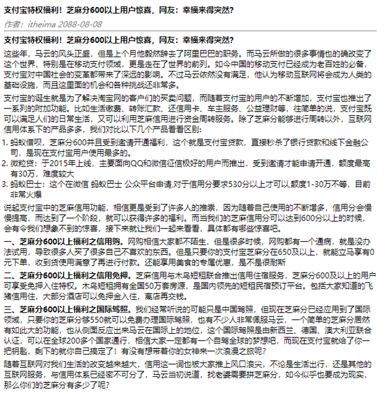
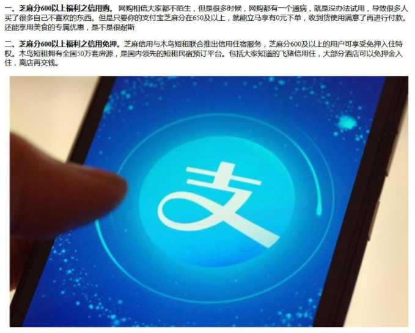
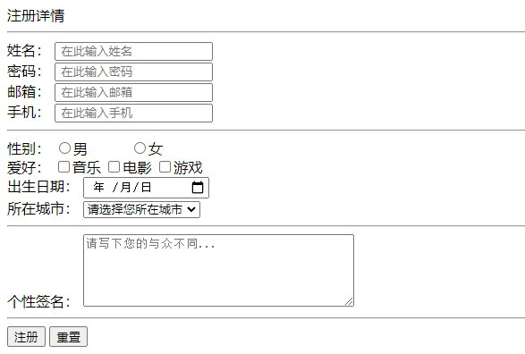
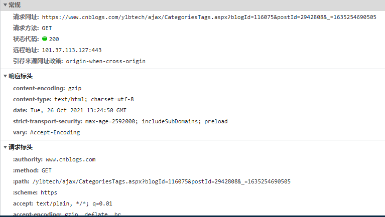

### 1.新闻页面

#### 1.1 需求



#### 1.2 素材

```
支付宝特权福利！芝麻分600以上用户惊喜，网友：幸福来得突然？


作者：itheima 2088-08-08


支付宝特权福利！芝麻分600以上用户惊喜，网友：幸福来得突然？


这些年，马云的风头正盛，但是上个月他毅然辞去了阿里巴巴的职务。而马云所做的很多事情也的确改变了这个世界，特别是在移动支付领域，更是走在了世界的前列。如今中国的移动支付已经成为老百姓的必备，支付宝对中国社会的变革都带来了深远的影响。不过马云依然没有满足，他认为移动互联网将会成为人类的基础设施，而且这里面的机会和各种挑战还非常多。


支付宝的诞生就是为了解决淘宝网的客户们的买卖问题，而随着支付宝的用户的不断增加，支付宝也推出了一系列的附加功能。比如生活缴费、转账汇款、还信用卡、车主服务、公益理财等，往简单的说，支付宝既可以满足人们的日常生活，又可以利用芝麻信用进行资金周转服务。除了芝麻分能够进行周转以外，互联网信用体系下的产品多多，我们对比以下几个产品看看区别:

1.蚂蚁借呗，芝麻分600并且受到邀请开通福利，这个就是支付宝贷款，直接秒杀了银行贷款和线下金融公司，是现在支付宝用户使用最多的。
2.微粒贷：于2015年上线，主要面向QQ和微信征信极好的用户而推出，受到邀请才能申请开通，额度最高有30万，难度较大
3.蚂蚁巴士：这个在微信 蚂蚁巴士 公众平台申请,对于信用分要求530分以上才可以,额度1-30万不等，目前非常火爆


说起支付宝中的芝麻信用功能，相信更是受到了许多人的推崇，因为随着自己使用的不断增多，信用分会慢慢提高，而达到了一个阶段，就可以获得许多的福利。而当我们的芝麻信用分可以达到600分以上的时候，会有令我们想象不到的惊喜，接下来就让我们一起来看看，具体都有哪些惊喜吧。


一、芝麻分600以上福利之信用购。网购相信大家都不陌生，但是很多时候，网购都有一个通病，就是没办法试用，导致很多人买了很多自己不喜欢的东西。但是只要你的支付宝芝麻分在650及以上，就能立马享有0元下单，收到货使用满意了再进行付款。还能享用美食的专属优惠，是不是很耐斯


二、芝麻分600以上福利之信用免押。芝麻信用与木鸟短租联合推出信用住宿服务，芝麻分600及以上的用户可享受免押入住特权。木鸟短租拥有全国50万套房源，是国内领先的短租民宿预订平台。包括大家知道的飞猪信用住，大部分酒店可以免押金入住，离店再交钱。


三、芝麻分600以上福利之国际驾照。我们经常听说的可能只是中国驾照，但现在芝麻分已经应用到了国际领域，只要你的芝麻分够550就可以免费办理国际驾照，也有不少人非常佩服马云，一个简单的芝麻分居然有如此大的功能，也从侧面反应出来马云在国际上的地位，这个国际驾照是由新西兰、德国、澳大利亚联合认证，可以在全球200多个国家通行，相信大家一定都有一个自驾全球的梦想吧，而现在支付宝就给了你一把钥匙，剩下的就你自己搞定了！有没有想带着你的女神来一次浪漫之旅呢？


随着互联网对我们生活的改变越来越大，信用这一词也被大家推上风口浪尖，不论是生活出行，还是其他的互联网服务，与信用体系已经密不可分了，马云当初说道，找老婆需要拼芝麻分，如今似乎也要成为现实，那么你们的芝麻分有多少了呢？

```

#### 1.3 扩展需求

?	在原来的基础上添加图片，图片素材在资料里面




### 2.注册详情

#### 2.1 需求




### 3.动手实践

```html
<!DOCTYPE html>
<html lang="en">
<head>
    <meta charset="UTF-8">
    <title>Title</title>
</head>
<body>
    <form action="#" method="GET|POST">
        <input type="text" name="username">
        <input type="submit">
    </form>
</body>
</html>
```

使用浏览器工具查看GET请求和POST请求的区别！并留意查看提交的数据




### 4.答案

#### 4.1新闻页面

```html
<!DOCTYPE html>
<html lang="en">
<head>
    <meta charset="UTF-8">
    <title>头条页面</title>
</head>
<body>
        <div>
            <h1>支付宝特权福利！芝麻分600以上用户惊喜，网友：幸福来得突然？</h1>
        </div>

        <div>
            <i><font size="2" color="gray">作者：itheima 2088-08-08</font></i>
            <hr/>
        </div>

        <div>
            <h3>支付宝特权福利！芝麻分600以上用户惊喜，网友：幸福来得突然？</h3>
        </div>

        <div>
            <p>这些年，马云的风头正盛，但是上个月他毅然辞去了阿里巴巴的职务。而马云所做的很多事情也的确改变了这个世界，特别是在移动支付领域，更是走在了世界的前列。如今中国的移动支付已经成为老百姓的必备，支付宝对中国社会的变革都带来了深远的影响。不过马云依然没有满足，他认为移动互联网将会成为人类的基础设施，而且这里面的机会和各种挑战还非常多。</p>

            <p>支付宝的诞生就是为了解决淘宝网的客户们的买卖问题，而随着支付宝的用户的不断增加，支付宝也推出了一系列的附加功能。比如生活缴费、转账汇款、还信用卡、车主服务、公益理财等，往简单的说，支付宝既可以满足人们的日常生活，又可以利用芝麻信用进行资金周转服务。除了芝麻分能够进行周转以外，互联网信用体系下的产品多多，我们对比以下几个产品看看区别:
            <ol type="1">
                <li>蚂蚁借呗，芝麻分600并且受到邀请开通福利，这个就是支付宝贷款，直接秒杀了银行贷款和线下金融公司，是现在支付宝用户使用最多的。</li>
                <li>微粒贷：于2015年上线，主要面向QQ和微信征信极好的用户而推出，受到邀请才能申请开通，额度最高有30万，难度较大</li>
                <li>蚂蚁巴士：这个在微信 蚂蚁巴士 公众平台申请,对于信用分要求530分以上才可以,额度1-30万不等，目前非常火爆</li>
            </ol>
            
            </p>

            <p>说起支付宝中的芝麻信用功能，相信更是受到了许多人的推崇，因为随着自己使用的不断增多，信用分会慢慢提高，而达到了一个阶段，就可以获得许多的福利。而当我们的芝麻信用分可以达到600分以上的时候，会有令我们想象不到的惊喜，接下来就让我们一起来看看，具体都有哪些惊喜吧。</p>

            <p><b>一、芝麻分600以上福利之信用购。</b>网购相信大家都不陌生，但是很多时候，网购都有一个通病，就是没办法试用，导致很多人买了很多自己不喜欢的东西。但是只要你的支付宝芝麻分在650及以上，就能立马享有0元下单，收到货使用满意了再进行付款。还能享用美食的专属优惠，是不是很耐斯</p>

            <p><b>二、芝麻分600以上福利之信用免押。</b>芝麻信用与木鸟短租联合推出信用住宿服务，芝麻分600及以上的用户可享受免押入住特权。木鸟短租拥有全国50万套房源，是国内领先的短租民宿预订平台。包括大家知道的飞猪信用住，大部分酒店可以免押金入住，离店再交钱。</p>
            

            <p><b>三、芝麻分600以上福利之国际驾照。</b>我们经常听说的可能只是中国驾照，但现在芝麻分已经应用到了国际领域，只要你的芝麻分够550就可以免费办理国际驾照，也有不少人非常佩服马云，一个简单的芝麻分居然有如此大的功能，也从侧面反应出来马云在国际上的地位，这个国际驾照是由新西兰、德国、澳大利亚联合认证，可以在全球200多个国家通行，相信大家一定都有一个自驾全球的梦想吧，而现在支付宝就给了你一把钥匙，剩下的就你自己搞定了！有没有想带着你的女神来一次浪漫之旅呢？</p>

            <p>随着互联网对我们生活的改变越来越大，信用这一词也被大家推上风口浪尖，不论是生活出行，还是其他的互联网服务，与信用体系已经密不可分了，马云当初说道，找老婆需要拼芝麻分，如今似乎也要成为现实，那么你们的芝麻分有多少了呢？</p>
        </div>
</body>
</html>
```

#### 3.2 注册详情

```html
<!DOCTYPE html>
<html lang="en">
<head>
    <meta charset="UTF-8">
    <title>注册页面</title>
</head>
<body>
    <!--中间-注册信息-->
    <div >
        <div>注册详情</div>
        <hr/>

        <!--表单标签-->
        <form action="#" method="get">
            <div>
                <label for="username">姓名：</label>
                <input type="text" id="username" name="username" value="" placeholder=" 在此输入姓名" required/>
            </div>

            <div>
                <label for="password">密码：</label>
                <input type="password" id="password" name="password" value="" placeholder=" 在此输入密码" required/>
            </div>

            <div>
                <label for="email">邮箱：</label>
                <input type="email" id="email" name="email" value="" placeholder=" 在此输入邮箱" required/>
            </div>

            <div>
                <label for="tel">手机：</label>
                <input type="tel" id="tel" name="tel" value="" placeholder=" 在此输入手机" required/>
            </div>
            <hr/>

            <div>
                <label for="gender">性别：</label>
                <input type="radio" id="gender" name="gender" value="man"/>男 &nbsp;&nbsp;&nbsp;&nbsp;&nbsp;&nbsp;&nbsp;&nbsp;
                <input type="radio" name="gender" value="woman"/>女 &nbsp;&nbsp;&nbsp;&nbsp;&nbsp;&nbsp;&nbsp;&nbsp;
            </div>

            <div>
                <label for="hobby">爱好：</label>
                <input type="checkbox" id="hobby" name="hobby" value="music"/>音乐
                <input type="checkbox" name="hobby" value="movie"/>电影
                <input type="checkbox" name="hobby" value="game"/>游戏
            </div>

            <div>
                <label for="birthday">出生日期：</label>
                <input type="date" id="birthday" name="birthday" value=""/>
            </div>

            <div>
                <label for="city">所在城市：</label>
                <select id="city" name="city">
                    <option>请选择您所在城市</option>
                        <option>北京</option>
                        <option>上海</option>
                        <option>广州</option>
                        <option>深圳</option>
                        <option>西安</option>
                        <option>杭州</option>
                        <option>郑州</option>
                        <option>武汉</option>
                </select>
            </div>
            <hr/>

            <div>
                <label for="desc">个性签名：</label>
                <textarea id="desc" name="desc" rows="5" cols="40" placeholder="请写下您的与众不同..."></textarea>
            </div>
            <hr/>

            <button type="submit">注册</button>
            <button type="reset">重置</button>
        </form>
    </div>
</body>
</html>
```

